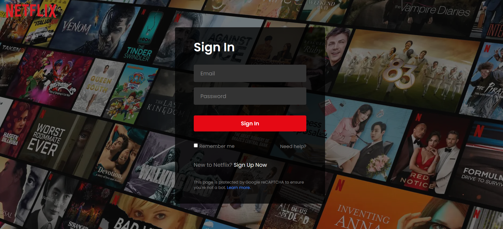
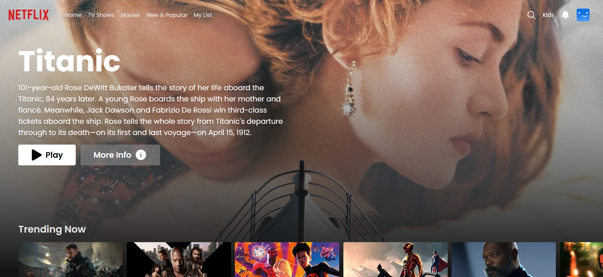
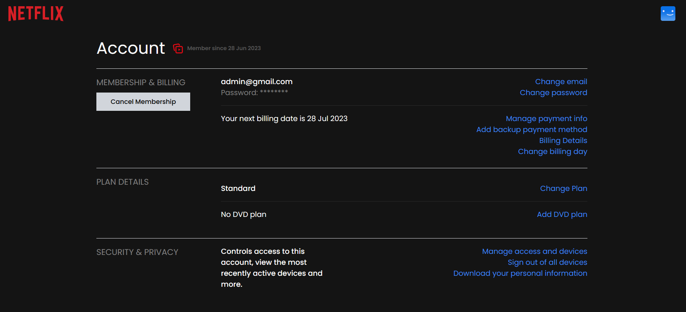
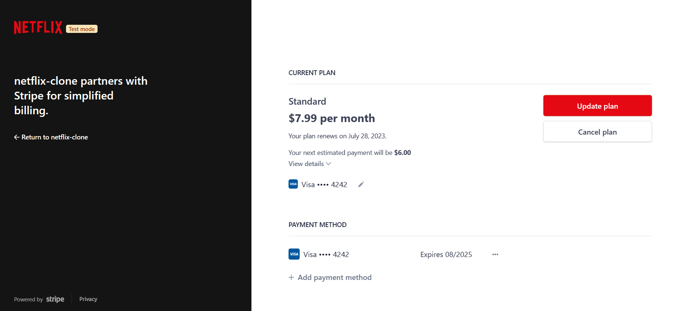
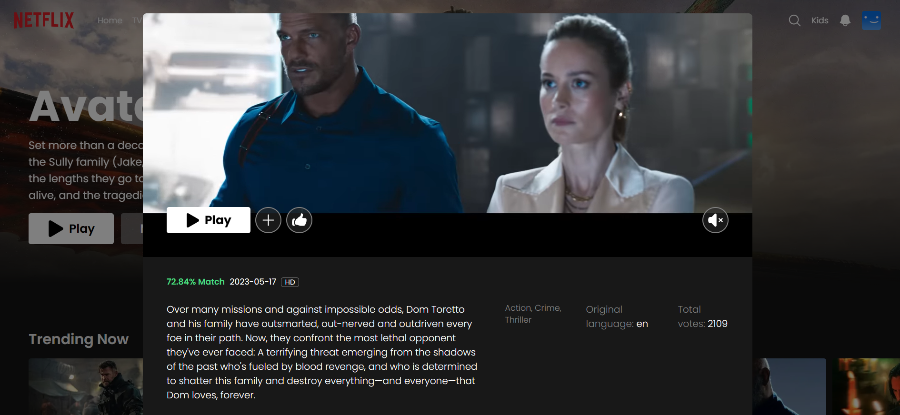

# PicturePulse - Neflix Clone

Discover a world of cinematic wonders at your fingertips. PicturePulse is a dynamic streaming platform that pulsates with captivating films and TV shows. Immerse yourself in an expansive library of entertainment, where every frame tells a story. With PicturePulse, you can indulge in a pulsating cinematic experience from the comfort of your own home.

## Introduction

PicturePulse is a full-stack web application cloned from netflix. It is built with Next.js, a React framework. PicturePulse allows users to browse through a library of movies and TV shows, watch trailers, and add titles to their list.

## Technologies


- Next.js (React framework)
- tailwindcss (styling)
- firebase (authentication, database, storage)
- tmdb API (movie database)
- vercel (deployment)
- react-player (video player)
- recoil (state management)
- stripe (payment processing)

## Features

- User authentication
- Browse through a library of movies
- Watch trailers
- Add movies to your list
- Payment processing
- Upgrade or cancel your subscription

## Features planned for future implementation

- Add TV shows
- Change different landing page backgrounds
- Search for movies and TV shows
- Add more categories
- User management (change password, delete account)
- User profiles
- UI improvements

## Challenges Faced

- TypeScript - This was one of my first projects using TypeScript. I had to learn how to use it and how to integrate it with Next.js. I also had to learn how to use the tmdb API with TypeScript.

- Firebase - This was my first time using Firebase. I had to learn how to use Firebase authentication, database, and storage. I also had to learn how to integrate Firebase with Next.js. Also, I had to get trial version of Firebase Blaze plan to use Firebase storage and get Stripe Extension for Firebase.

- Stripe - This was also my first time using Stripe. I had to learn how to use Stripe with Firebase and Next.js. I also had to learn how to use Stripe Elements and Stripe Checkout. I had so much fun implementing Stripe and I am looking forward to using it in future projects.

- Recoil - This was my first time using Recoil. And first time, I heard about it. At then , I only know Redux for state management. But Redux is too much complex and boilerplate for small project. So I decided to use Recoil for state management. It is very easy to use and I am looking forward to using it in future projects.

- Transpile Error - I got an error when using stripe package with nextjs. I believe the error was caused by the stripe package not being transpiled. I think the reason because nextjs uses hot reloading and stripe package is not transpiled.
  I solved this error by adding the following code to my next.config.js file.

```javascript
const withTM = require("next-transpile-modules")([
  "@stripe/firestore-stripe-payments",
]);
//Pass the modules you would like to see transpiled

const nextConfig = {
  reactStrictMode: true,
  images: {
    domains: ["rb.gy", "image.tmdb.org", "res.cloudinary.com"],
  },
};

module.exports = withTM(nextConfig);
```

- Bugs - I also had to fix a lot of bugs during the development process. It was a great learning experience.

## Screenshots







## How to run the project locally

1. Clone the repository

```bash
git clone https://github.com/kingmalitha/nextjs-netflix-clone.git
```

2. Install dependencies

```bash
npm install
```

3. Create a .env.local file in the root directory and add the environment variables stated in the .env.example file

4. Run the development server

```bash
npm run dev
```

5. Open [http://localhost:3000](http://localhost:3000) with your browser to see the result.

6. Enjoy!

## Acknowledgements

[Ali code](https://www.youtube.com/channel/UCW5YeuERMmlnqo4oq8vwUpg) - I followed his tutorial to build this project. I learned a lot from his tutorial. I am very grateful to him for making this tutorial.
